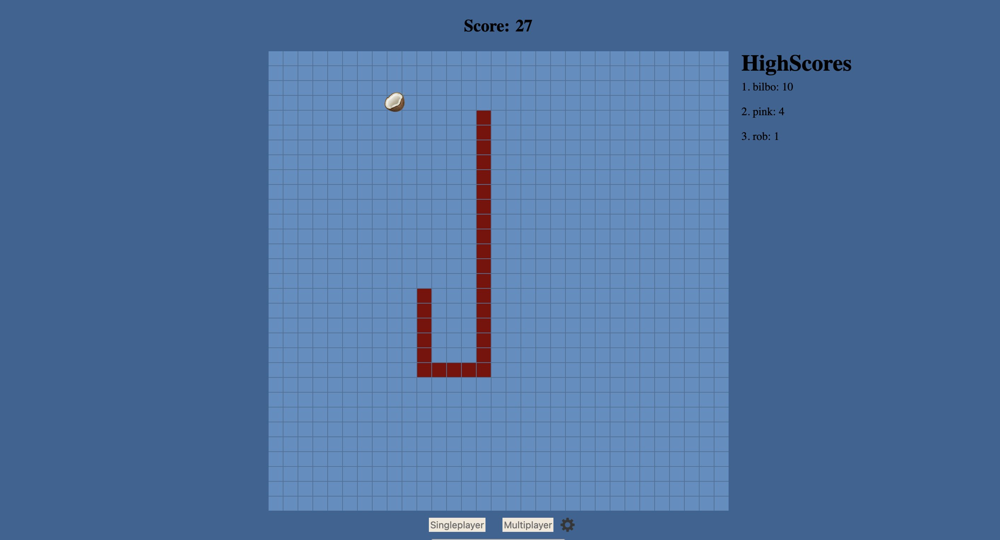

# Snake
## Technologies used
- Javascript
- HTML
- CSS
- firebase
## dependencies
- http-server (optional)
  - download with `npm install -g http-server`

## Getting Started
1. clone repo
2. run http-server or whichever server program you prefer on any available port
3. open localhost:PORT
4. check the settings icon (gear icon next to game mode) to change singleplayer
   settings
5. Optional: multiplayer requires a firebase key and creation of document
   templates
6. Use WASD or arrowkeys to move, collect fruits to increase your size!

## Wireframes

## Timeline
Do not neglect to plan, you will thank yourself later for being proactive!
| Day       |   | Task                                                                | Blockers                    | Notes/ Thoughts                  |
|-----------|---|---------------------------------------------------------------------|-----------------------------|----------------------------------|
| Friday    |   | Create and present proposal                                         |                             |                                  |
| Saturday  |   | research network/db options                                         | idk what Im doing           |                                  |
| Sunday    |   | lose hope                                                           | still dunno what im doing   |                                  |
| Monday    |   | start on firebase                                                   | breaking all my code        |                                  |
| Tuesday   |   | create getters and setters and add player collision for multiplayer | slowly understanding fb api | collision = easy. get/set = hard |
| Wednesday |   | different player colors/alternate controls                          |                             |                                  |
| Thursday  |   | highscores/names                                                    |                             | harder than expected             |
| Friday    |   | sync fruits with                                                    |                             | was way harder than expected     |
|           |   |                                                                     |                             |                                  |

## attributions
https://firebase.google.com/

## Icebox
- localStorage highscore
- build to configure firebase doucment creation
- remove ghost snakes (games haunted)

