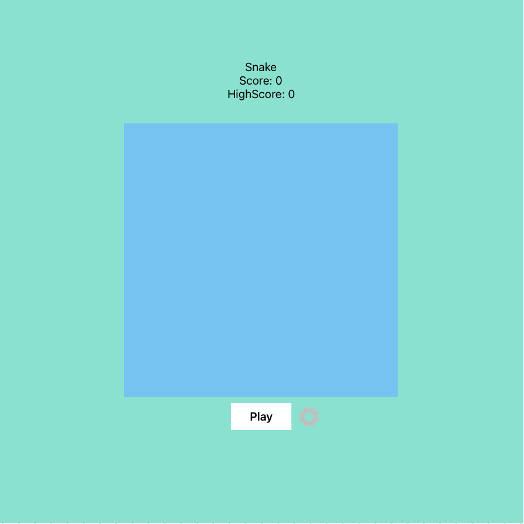
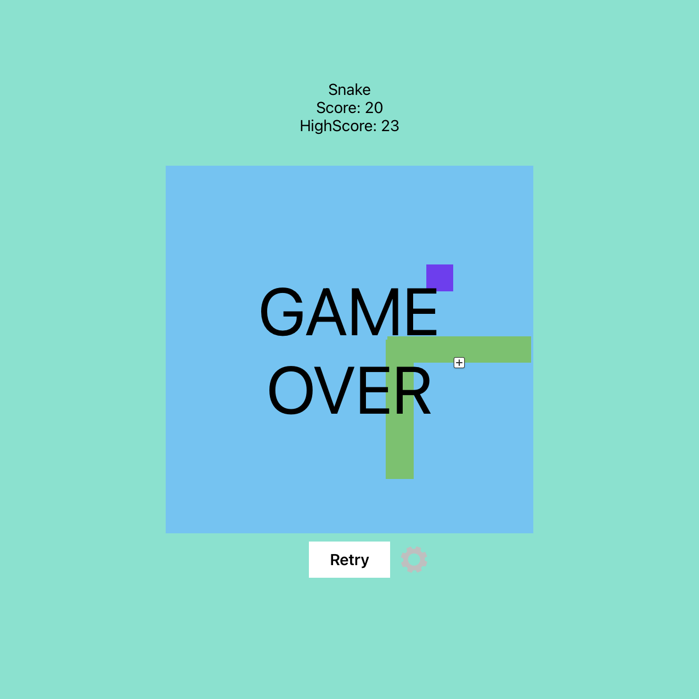

# Project Proposal

## Project Choice (Tell us which project you're doing!)

- Snake

## Project Description 

My game will be snake. you start as a dot on a grid, control the dot with WASD
to collect a point, the more points the player collects, the longer the snake
gets. If the player collides with a wall, or theirself, the game is over.

## Wire Frames

**Initial Landing View**

**Results View**

## User Stories

#### MVP Goals

- As a player, as a player, I want my snake to move based on w,a,s,d (North,
  East, South, West, respectively)
- As a player, I would like to see where the points are on the screen
- As a player, I would like to know what my current score is
- As a player, I would like to know when I lose the game, either running into a
  wall or myself
- As a player, I would like to be able to start a new game when the previous
  game ends
- As a player, I would like to edit some of the settings (size of the board, how
  fast I move) in between games

#### Stretch Goals

- As a player, I would like to see what my highscore is between sessions
- As a player, I would like a countdown between the time I click play/retry and
  when the new game starts
- As a player, I would like to play this game online so that I don't have to
  have my challenger sitting next to me.
- As a player, I want to be able to change the theme of the game
  (webpage/board/snake/point color)
- As a player, I want the fruits to be represented as fruit emojis

!!!
#### Notionboard Template
Notionboard template for building projects ( You can use this for any project )
https://www.notion.so/GA-Unit-3-Tunr-Lab-da2c82fafd4e4a7aa654676732db9ee3
!!!

#### Timeline - Daily Accountability

Do not neglect to plan, you will thank yourself later for being proactive!
| Day       |   | Task                                   | Blockers | Notes/ Thoughts |
|-----------|---|----------------------------------------|----------|-----------------|
| Friday    |   | Create and present proposal            |          |                 |
| Saturday  |   | Create html, js, css files             |          |                 |
| Sunday    |   | create html board structure            |          |                 |
| Monday    |   | add functions to manipulate dom state  |          |                 |
| Tuesday   |   | add functionality to manage game state |          |                 |
| Wednesday |   | add styling                            |          |                 |
| Thursday  |   | Work on stretch goals                  |          |                 |
| Friday    |   | Presentation Day!                      |          |                 |
